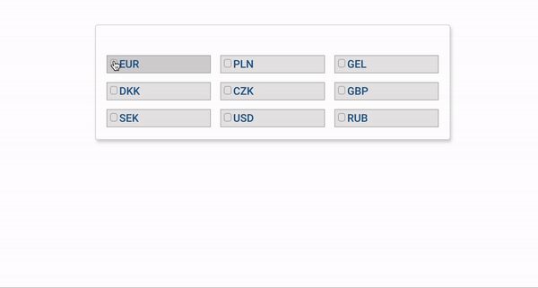

<h1>Hi! 👋 </h1>

Software developer working with HTML/CSS, React and Redux, Vue.js, Angular, Javascript, Typescript, Git. Passionate for learning! Love to learn a new things and skills, discover new places and get new impressions.
Persistent and focused on result. 

<h4>My Motto:</h4>

The more skills I have, the more times I am a Human.

##Check out my latest projects

###More about me on

